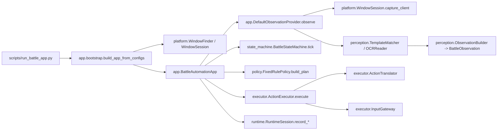
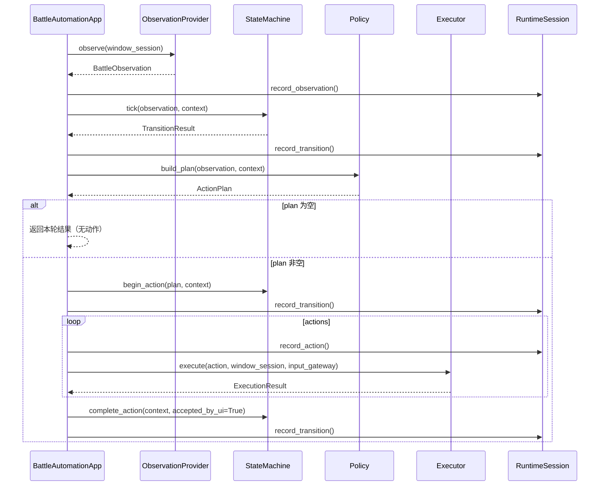
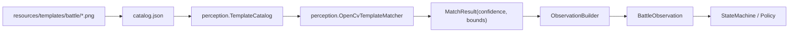

# 大话西游2 自动化运行流程

## 总体调用链

## `run_once()` 时序

## 模板识别链路

## 真实点击执行约束（当前阶段）

1. 涉及真实点击时，默认使用提权环境执行。
2. 游戏窗口需前台可聚焦，执行前先 `focus_window`。
3. 非战斗底栏优先使用网格化坐标：`start_x=870, step_x=40, y=792`。
4. 按钮命中优先走 `button_ref`（来自 `configs/ui/button-calibration.json`），避免硬编码散落坐标。

## 关键入口文件

- [run_battle_app.py](/D:/Codex/dhxy2-automation/scripts/run_battle_app.py)
- [bootstrap.py](/D:/Codex/dhxy2-automation/src/app/bootstrap.py)
- [service.py](/D:/Codex/dhxy2-automation/src/app/service.py)
- [observation_provider.py](/D:/Codex/dhxy2-automation/src/app/observation_provider.py)
- [translator.py](/D:/Codex/dhxy2-automation/src/executor/translator.py)
- [button_calibration.json](/D:/Codex/dhxy2-automation/configs/ui/button-calibration.json)
