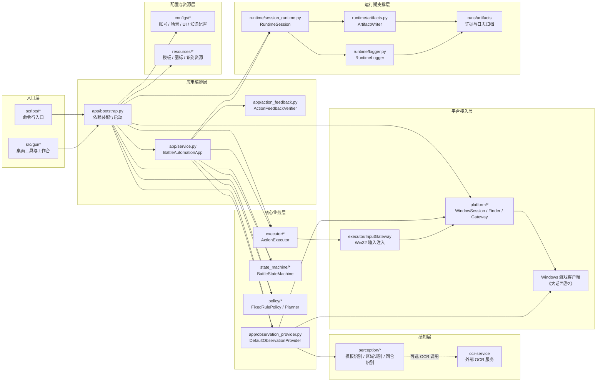
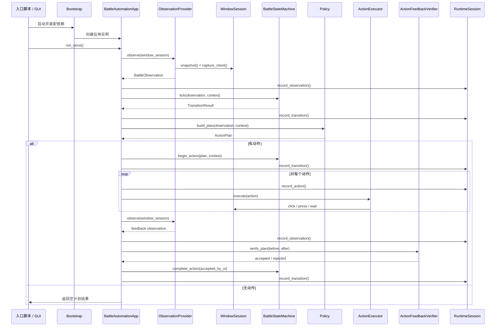

# 《大话西游2》自动化服务架构图

## 1. 文档目的

本文档从“服务协作”视角描述 `dhxy2-automation` 当前架构。

这份图不替代模块拆解图，重点回答三个问题：

- 系统从哪个入口启动
- 核心服务之间如何协作
- 外部依赖和运行期支撑挂在哪一层

## 2. 服务架构总图

## 3. 单次 Tick 服务链路

## 4. 服务职责摘要

| 服务 | 位置 | 职责 |
| --- | --- | --- |
| Bootstrap | `src/app/bootstrap.py` | 装配窗口会话、配置、识别器、状态机、策略、执行器和运行期对象 |
| BattleAutomationApp | `src/app/service.py` | 单次 tick 编排中心，驱动观察、状态迁移、动作执行和反馈闭环 |
| DefaultObservationProvider | `src/app/observation_provider.py` | 把窗口截图、命名区域、模板匹配结果汇总成 `BattleObservation` |
| BattleStateMachine | `src/state_machine/*` | 根据观察结果维护当前战斗状态并控制迁移 |
| FixedRulePolicy / Planner | `src/policy/*` | 根据角色配置和观察结果生成动作计划 |
| ActionExecutor | `src/executor/*` | 将领域动作翻译为输入序列并执行 |
| RuntimeSession | `src/runtime/*` | 记录 observation、transition、action，并写入证据和日志 |
| OCR Service | 外部独立仓库 | 提供可选 OCR 能力，不与主项目运行时强耦合 |

## 5. 当前图的使用原则

- 模块拆解图用于看“功能范围”和完成度
- 本文服务架构图用于看“运行时协作关系”
- 后续如果增加调度器、多开管理器、OCRClient 或任务流引擎，应优先在本图中补充服务位置，再落代码实现
